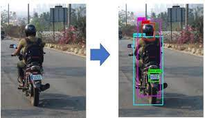

# Data Science Portfolio
---
## Machine learning

### Automatic Helmet Detection

Provide Lisence plate numbers of motocycle riders without helmets. A custom trained Object Detection model based on YOLO-v3 architecture was used to detect riders without helmets from live feed of surveillence cameras or images. 

